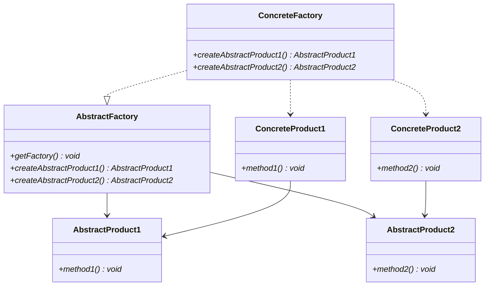

# Abstract Factory pattern

## Purpose

Abstract Factoryパターンを使うと、関連したり依存しあうオブジェクト群のインスタンスを生成することができる。

## Class diagram

### AbstractFactory

抽象的な工場。このクラスのgetFactoryメソッドで、具体的な工場（ConcreteFactory）のインスタンスを生成する。getFactoryメソッドをstaticにすることで、AbstractFactoryをインスタンス化しなくても、メソッドを呼び出せる。また、抽象的な部品を生成する抽象メソッドも用意しておく。

OsFactoryクラスがこれに該当する。

### AbstractProduct

抽象的な部品。このクラスで部品のインターフェイスを定義しておく。

OsDisplaySystem、OsFileSystemクラスがこれに該当する。

### ConcreteFactory

具体的な工場。このクラスから、具体的な部品（ConcreteProduct）を生成する。

WindowsFactory、LinuxFactoryクラスがこれに該当する。

### ConcreteProduct

具体的な部品。このクラウ内で処理を実装する。

WindowsDisplaySystem、WindowsFileSystem、LinuxDisplaySystem、LinuxFileSystemクラスがこれに該当する。

## i.e.

getFactory()内では、Classクラスを使ってインスタンスを生成することをオススメする。if文やswitch文を使ってインスタンスを生成してしまうと、拡張があった際にFactoryクラスの修正が必要になる。Classクラスを使って、動的にメソッド呼び出しなど行うことをリフレクションという。

## Usage Scenes

Abstract Factoryパターンは以下のような場合に使用する。

* Product（部品）が複数存在する場合
* Product（部品）を拡張する可能性がある場合
* 実行環境（OS、DB、プラットフォーム、バージョンなど）に追加や変更が生じる場合

## Problem

部品の種類を追加する場合。AbstractFactoryクラスにメソッドを追加する必要が出てくるが、それはサブクラスのすべてにメソッドを追加する必要がある。

そのため、生成する部品についてあらかじめ網羅しておくと、後々の保守が楽になる。

## Relationship to other patterns

### Singletonパターン

ConcreteFactoryクラスは通常、1つだけ生成すれば良いため、Singletonパターンが使われる。

### Prototypeパターン

ConreteProductクラスを生成する際に、Prototypeパターンでインスタンスを生成することがある。

### Factory Methodパターン

ConcreteFactoryクラスでは、Factory Methodパターンを使用して、ConcreteProductを生成する。

## Conclusion

* 複数のサブクラス群をまとめて変更したい場合、Abstract Factoryパターンを使用する
* Factoryクラス、Productクラスを抽象化する（インターフェイスだけ決めておく）
* Factoryクラスに、Factoryのサブクラスのインスタンスを生成するstaticメソッドを用意する

