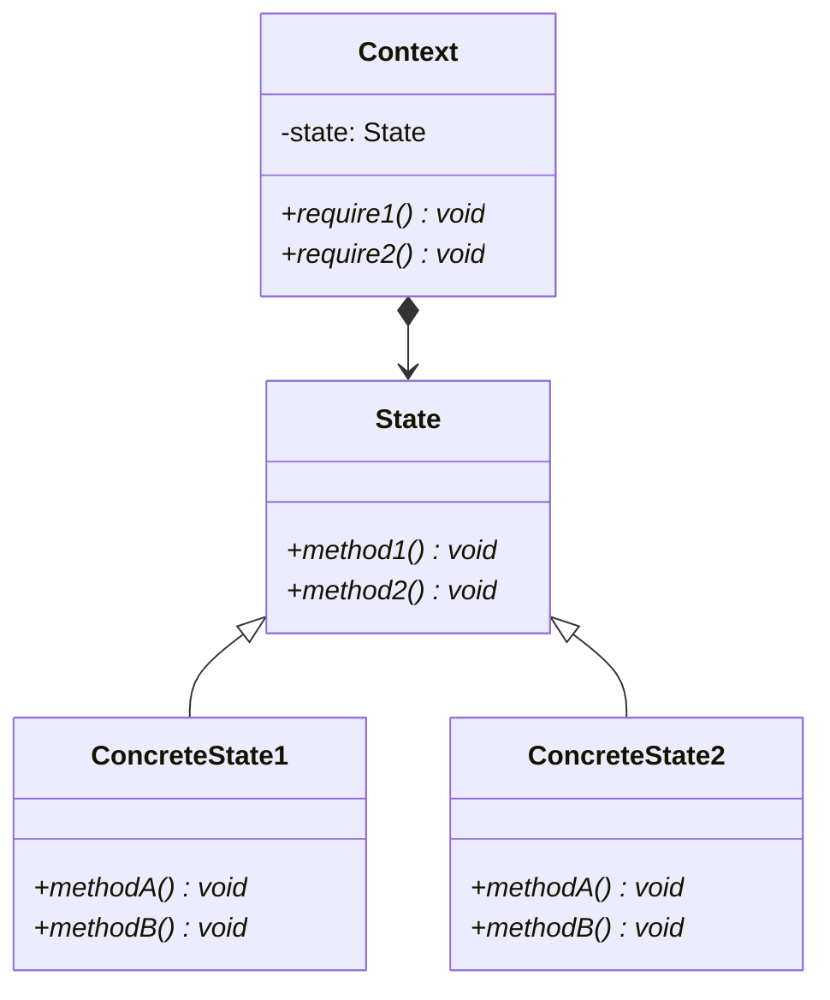

# State pattern

## Purpose

状態を表すクラスを導入することで、状態による条件分岐をなくす。それにより、拡張性高めることができる。

## Class diagram

### Context

状態による処理を利用するAPIを定義する。また、現在の状態を表すConcreteStateのインスタンスをフィードとして持つ。

Shopクラスがこれに該当する。

### State

状態を表すインターフェイス。Contextクラスから呼び出されるインターフェイスを定義しておく。

WeekStateクラスがこれに該当する。

### ConcreteState

具体的な状態を表すクラス。Stateクラスで定義されたインターフェイスを実装する。

WeekdaysStateとHolidayStateクラスがこれに該当する。

## i.e.

Stateパターンでは、状態の追加が簡単だ。なぜなら、クラスを1つ追加すれば良い。ただし、状態遷移の部分に気をつけなければならない。

そして、状態に依存する処理を追加するのは大変だ。処理を追加するためには、インターフェイスにメソッドを追加するからだ。そうなると、そのサブクラスでメソッドの実装が必要になる。当然、そこのテストも必要になる。

デザインパターンに限らず、インターフェイスを利用すると、クラスの追加は容易だが、メソッドの追加は大変。

## Usage Scenes

Stateパターンは以下のような場合に使用する。

### 状態による分岐を多数利用している場合

たとえば、状態による分岐（if文など）が至る所にあるとする。しかも、分岐の条件は毎回同じ。これでは、変更にとても弱くなる。もしも状態を追加すると言った場合、影響箇所が多くなるからだ。Stateパターンを使えば、Contextクラスのインスタンスを生成して丸投げするだけで済む。

### 状態を追加する可能性がある場合

状態の追加自体は簡単だ。Stateを実装したクラスを用意すれば良い。

## Problem

サンプルコードでは平日状態と土曜状態の切り替えをConcreteStateであるWeekdaysStateとHolidayState内で行っていた。これにより、Shopクラスは状態遷移を管理する必要がなくなった。

一方で、WeekdaysStateとHolidayStateの結びつきが強くなっている。状態を切り替えるためには、お互いのインスタンスを取得するメソッドを呼び合っているからだ。状態が2つだけならば、まだ切り替えも簡単だが、新しい状態を追加したい場合が少し大変になる。状態の切り替えをおこなっている部分について、両方のクラスを慎重に修正する必要があるからだ。

では、状態の切り替えをContextクラスで行えばいいのでは？と考えたかもしれない。それもStateパターンの1つだが、サンプルコードにおけるShopクラスのsetDateメソッド内に、if文などで状態を切り替えるコードを入れる。ただし、その場合は、ContextとConcreteStateの結びつきが強くなる。

## Relationship to other patterns

Stateパターンと関連性があるのは以下のパターン。

### Singletonパターン

状態を表すインスタンスは1つで済むことが多い。その場合にSingletonパターンを使う。

### Flyweightパターン

状態と表すインスタンスをFlyweightパターンを使って再利用（共有）することができる

## Conclusion

* Stateパターンを使うことで、状態の分岐をなくして、拡張性を高めることができる。
* 状態を表すクラスが、状態ごとの処理も持つ。

