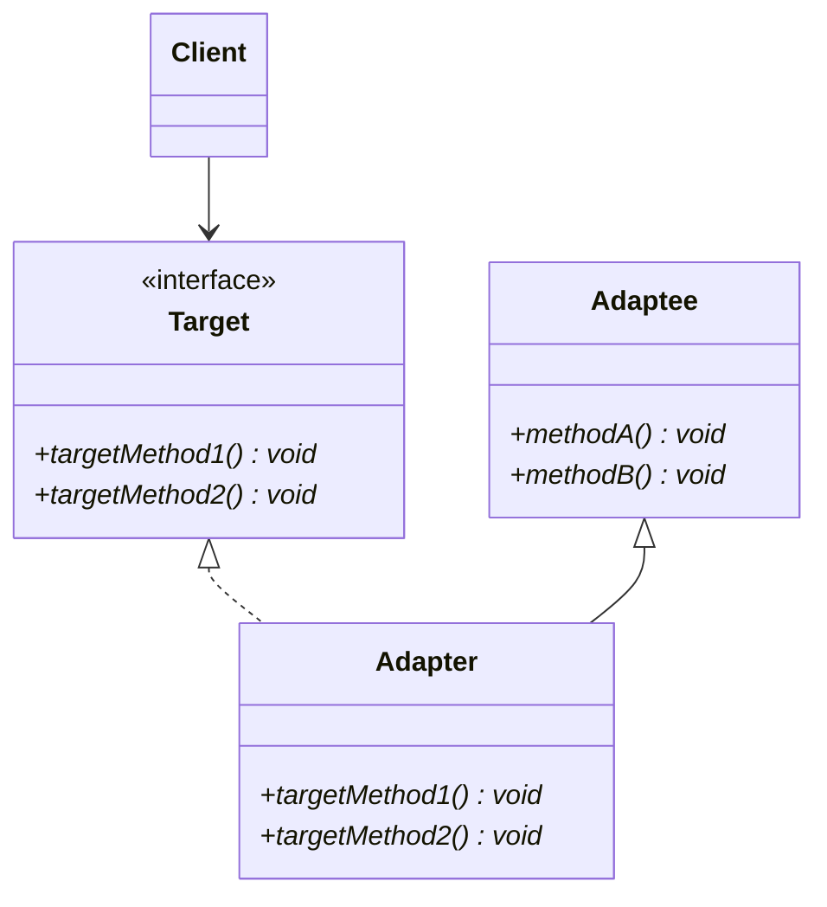
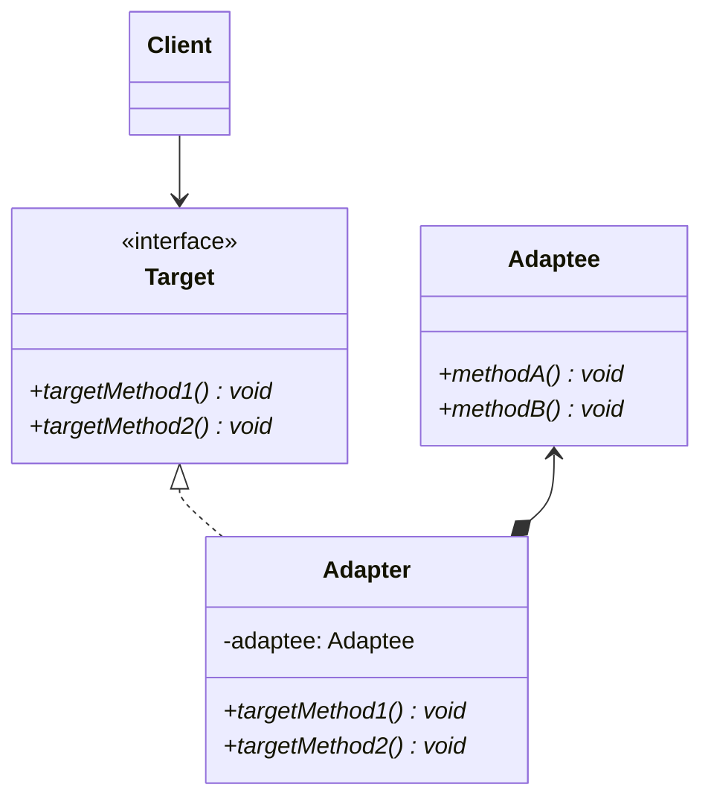

# Adapter pattern

## Purpose

Adapterパターンでは、あるクラスのインターフェイスを、別のインターフェイスに変換することができる。

## Class diagram

### Inheritance

### Delegate

### Target

Clientが必要なインターフェイスを表すクラス。

Printクラスがこれに該当する。

### Client

Targetを使うクラス。

 Mainクラスがこれに該当する。

### Adaptee

適合される側を表すクラス。

Showクラスがこれに該当する。

### Adapter

Targetのサブクラス。適合を行うクラス。

PrintAdapterクラスがこれに該当する。

## i.e.

既存のクラスがあるなら、それを修正すれば済む話だが、なぜAdapterパターンを使うのか？

まず、クラスを再利用できるならそれを再利用できた方が便利だし、開発も楽になる。それに、既存のクラスに問題がなければ、その部分はテストをする必要がなくなる。とくに、長年使われてきたようなクラスであれば、色々な箇所で利用されているかもしれない。だが、利用者が多いクラスに修正を入れるとリスクが多い。

だから、クラスに手を入れるよりかは、Adapterパターンを使おうとなる。

## Usage Scenes

Adapterパターンは以下のような場合に使用する。

* 既存のクラスを利用したいが、必要なインターフェイスと一致していない場合

## Problem

継承を使ったAdapterパターンでは、継承できるAdapteeが1つだけになる。

## Relationship to other patterns

Adapterパターンと関連性があるのは以下のパターン。

### Bridgeパターン

BridgeパターンとAdapterパターンは構造が似ているが、目的が異なる。Bridgeパターンは、機能と実装を分けることが目的。Adapterパターンは、異なるインターフェイスを変換することが目的。

### Decoratorパターン

Decpratorパターンでは、インターフェイスを変更することなく、機能を追加できる。Adapterパターンでは、インターフェイスのずれを埋める。

## Conclusion

* Adapterパターンでは、異なるインターフェイス同時を変換する。
* 実装方法には以下の2つがある。
  * 継承を使う
  * 委譲を使う

