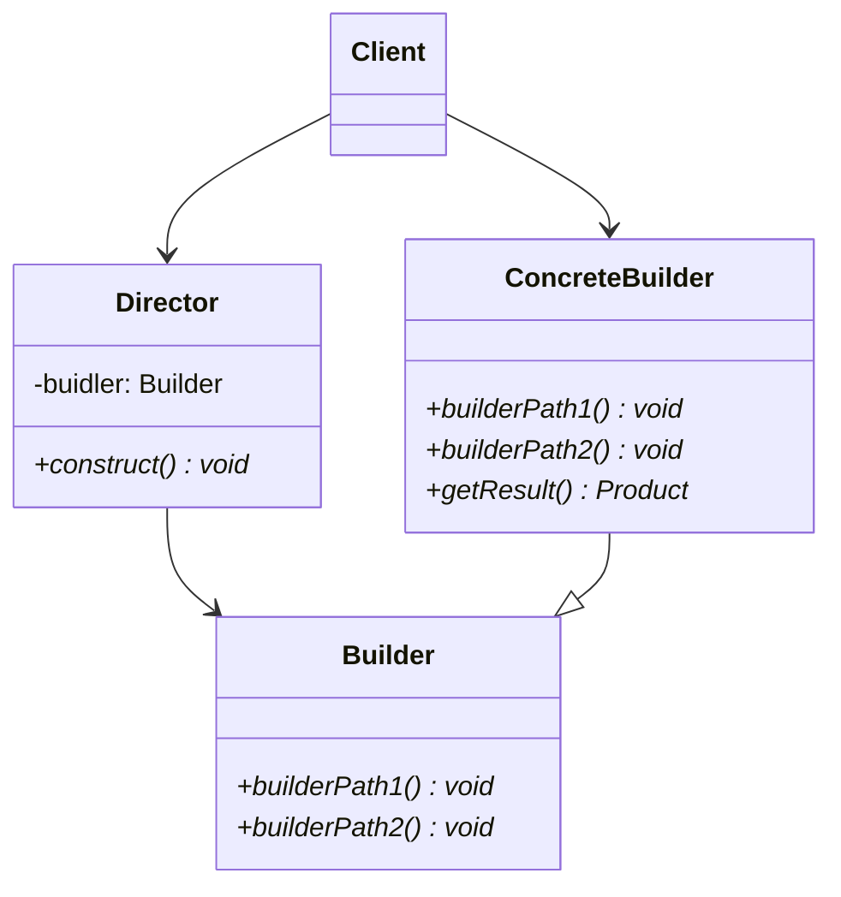

# Builder pattern

## Purpose

Builderパターンでは、複雑なインスタンを段階的に作成する。

## Class diagram

### Builder

このクラスでは、インスタンスを作り上げていくためのインターフェイス（API）を定義しておく。

Builderクラスがこれに該当する。

### ConcreteBuilder

Builderクラスのインターフェイスを実装して、インスタンスを作り上げていく。また、作成したインスタンスを取得する為のメソッドを用意する。

CsvBuilder、TextBuilderクラスがこれに該当する。

### Director

Builderのインターフェイスを使って、ConcreteBuilderを生成する。

Directorクラスがこれに該当する。

### Client

Directorにインスタンス生成の依頼を出す。

Mainクラスがこれに該当する。

## i.e.

移譲というのは、処理の一部を他のクラスに任せるということ。中には、丸投げしてしまうこともある。移譲を使うとどんな良いことがあるのだろうか。

Mainクラスからすれば、毎回、Builderクラスのメソッドを呼び出す必要がなく、Directorにお願いすれば面倒なことはやってくれる。

このように、Builderクラスのメソッドを呼び出して、インスタンスを作ってくれるAPIを提供してくれるのがDirectorクラス。他にも便利なことがある。

### Builderの影響を局所化できる

Builderのメソッドを呼び出す箇所がDirectorクラスだけであれば、Builderに修正があっても、Directorクラスを修正するだけで済む。他にも、Builderを使って色々なパターンでインスタンスを作成する処理がDirectorクラスにまとまっているため、コードの可動性も上がる。

### サブクラスを途中で変更できる

DirectorのようなAPIを提供するクラスを用意すると、ConcreteBuilderクラスを途中で変更することもできる。Builderパターンでは必要ないとは思うが、他のパターンでは実行するサブクラスを途中で変更する必要が出てくることがある。

## Usage Scenes

Builderパターンは以下のような場合に使用する。

### 段階的にインスタンスを生成する場合

インスタンスを段階的に生成する場合、Builderパターンが使える。他にも、インスタンス生成のコードを一箇所にまとめることもできるので、再利用性が上がる。同様に、コードの可動性も上がる。

### インスタンスの生成プロセスが多様な場合

オブジェクトを生成するプロセスが複数ある場合、constructメソッドを複数用意する。これは、Directorのサブクラスを用意して拡張することもできる。

## Problem

DirectorクラスがBuilderクラスのインターフェイスを呼び出して、インスタンスを作り上げていく。つまり、Builderクラスにはインスタンス生成に必要なインターフェイスを網羅しておかなければならないことを意味している。ここでいう網羅とは、以下の2つに備えるという意味。

### 現在の要件を満たすことができるのか

現在進行しているプロジェクトの要件を、Builderのインターフェイスで満たすことができるのかどうか、ということだ。

### 将来の拡張は大丈夫か

サンプルコードで言えば、将来XMLにも出力したいとした場合に、Builderクラスのインターフェイスだけで十分なのか、ということ。

## Relationship to other patterns

### Singletonパターン

Builderパターンと関連性があるのは以下のパターン。

### Abstract Factoryパターン

Abstract Factoryパターンでも複雑なインスタンスを作成する。Abstract Factoryパターンでは、インスタンスを即座に生成して返す。Builderパターンでは、インスタンスを徐々に作成して返す。

### Compositeパターン

Builderが作成するオブジェクトはCompositeパターンになることがある。

## Conclusion

* Builderパターンでは、段階的にインスタンスを作成していく。

