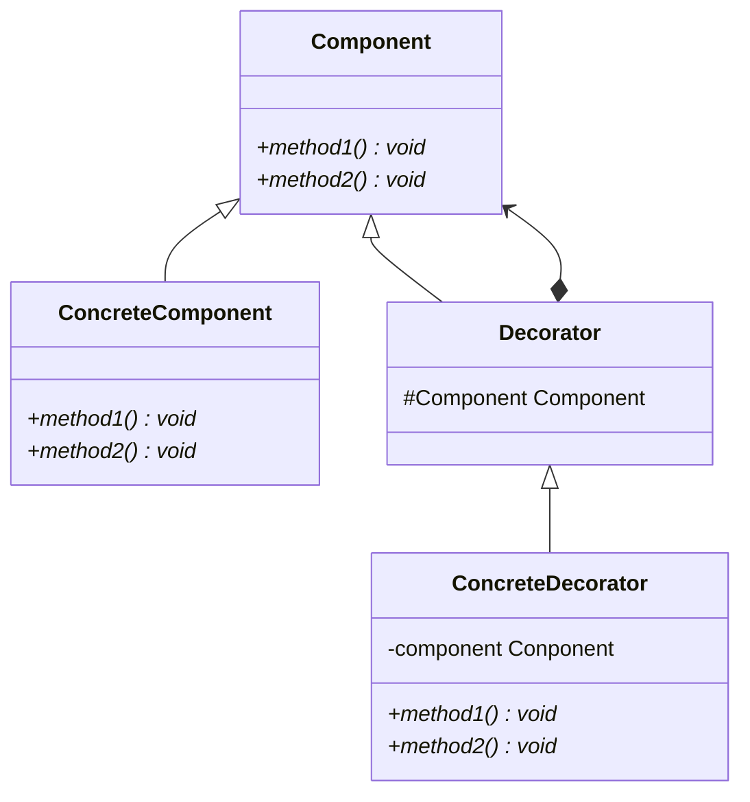

# Decorator pattern

## Purpose

Decoratorパターンではクラスの組み合わせを変えることで機能の追加ができる。

## Class diagram

### Component

中身と装飾を一緒に扱うためのクラス。このクラスで、各メソッドを定義しておく。

### ConcreteComponent

中身を表すクラス。

### Decorator

装飾の表すクラス。このクラス内に、Componentのインスタンスを持つように定義する。そうすることで、ConcreteDecoratorクラスからComponentのメソッドを呼び出すことができるようになる。

### ConcreteDecorator

具体的な装飾を表すクラス。

## Usage Scenes

Decoratorパターンは以下のような場合に使用する。

* インターフェイスを変えずに機能を追加したい場合
  * Decoratorパターンでは、機能ごとにクラスをあらかじめ用意しておき、クラスの組み合わせを変えることで、必要な機能を提供することができる。

## Problem

* クラスの数が増える。
  * ただし、Decoratorパターン使用を旨をドキュメントやJavadocに記載することで問題を回避できる。

## Relationship to other patterns

### Adapterパターン

Decoratorパターンでは、インターフェイスを変えずに機能を追加する。Adapterパターンでは、違うインターフェイスを提供する。

### Compositeパターン

Decoratorパターンでは、機能を動的に追加することが目的である。Compositeパターンでは、木構造などの部分と全体からなる構造を扱うことが目的である。

### Strategyパターン

Decoratorパターンでは、オブジェクトの中身を変えずに、装飾と追加していく。Strategyパターンでは、中身のオブジェクトを変える。

## Conclusion

* Decoratorパターンでは、中身と装飾を同一視することで再帰的な処理を行うことができる。
* 継承で機能を追加するのではなく、クラスの組み合わせで提供する機能を変えることができる。

