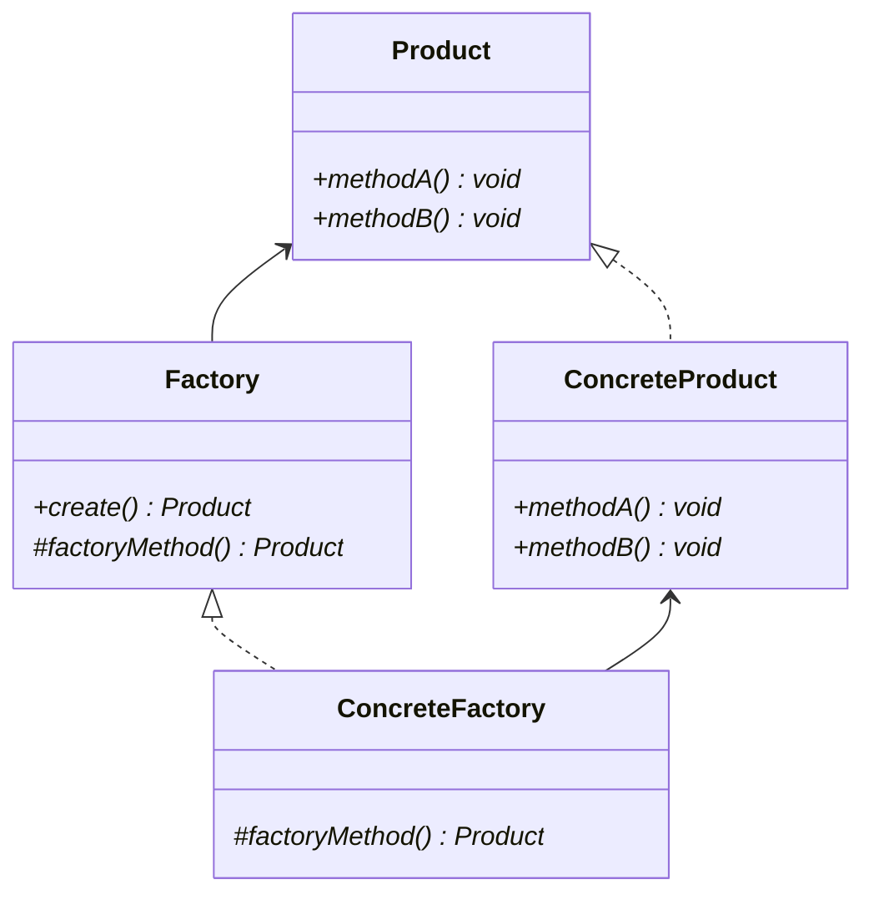

# Factory Method pattern

## Class diagram

### Factory

Factoryクラス。Product型のオブジェクトを返すfatoryMethodを定義しておく。

### ConcreteFactory

PcFactoryクラス。factoryMethodを実装して、ConcreteProductを生成する。

### Product

Productクラス。Productが使用するメソッドなどを定義しておく。

### ConcreteProduct

Pcクラス。メソッドなどの具体的な処理を実装する。

## Usage Scenes

### 生成するインスタンスを事前に把握できていない場合

factoryMethodがインスタンス生成を一手に引き受けてくれることで、どのサブクラスを生成すればいいのか、判断する必要がなくなる。（if文などで生成する場合）

これにより、生成しなければいけないインスタンスがわからなくても、開発を進めることができる。たとえば、factoryMethodからダミーのインスタンス（スタブ）を返すようにしておく。

### インスタンス生成時やその前後で、なんらかの処理をさせたい場合

Template Methodパターンを使用してインスランスを生成すれば、インスタンス生成の前後になんらかの処理を入れることもできる。すべてのインスタンスをnewで作成している場合、インスタンス生成の前後になんらかの処理を入れたいとなった場合の修正量が膨大になってしまう可能性がある。
