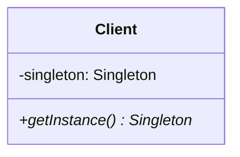

# Singleton pattern

## Purpose

Singletonパターンでは、インスタンスがひとつだけしか存在しないクラスを作る。

## Class diagram

### Singleton

1つしかインスタンスが存在しないクラス。

## i.e.

### インスタンスが生成されるタイミングについて

サンプルコードではSingletonクラスのstatic変数内でnew Singleton()とコンストラクタを呼び出しているが、getInstance()が呼ばれた時に、Singletonクラスのインスタンスが生成されている。

Javaにおいてクラスが初期化されるにはいくつかのパターンがある。通常はコンストラクタを実行すると初期化される。サンプルコードでは、メソッドの呼び出し（getInstance()）時にクラスが初期化されている。

### Spring Frameworkを使うと

Springを使えば、クラスに@BeanなどのアノテーションをつけるだけでSingletonパターンになる。また、その中のパラメーターを変えるだけでPrototypeパターンにすることもできる。

## Usage Scenes

Singletonパターンは以下のような場合に使用する。

* システム上でインスタンスがひとつだけしか存在してはならない場合

## Problem

ひとつだけではなく、5つだけインスタンスを生成する、ということも技術的には可能。しかし、そのような機会はあまりないし、実装も少し複雑になる。

## Relationship to other patterns

以下のパターンでは、Singletonパターンでインスタンスを生成することがある。

* Abstract Factoryパターン
* Builderパターン
* Factoryパターン
* Prototypeパターン

## Conclusion

* Singletonパターンでは、オブジェクトが1つだけしか存在しない。
* Singletonに必要な要件は以下の3つ。

1. private staticフィールドに自分のインスタンスを持っておく
2. privateのコンストラクタを持つ
3. インスタンスを取得するstaticメソッドを持つ

