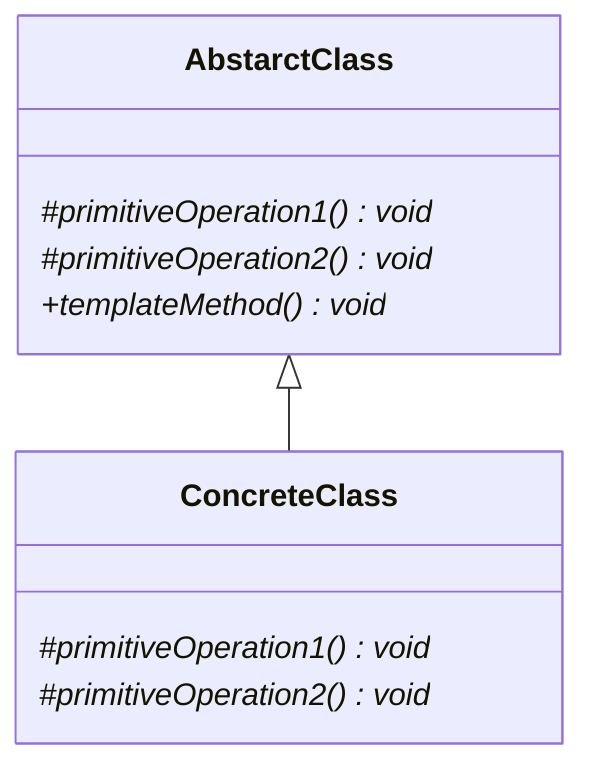

# Template Method pattern

## Purpose

Template Methodパターンを使うと、アルゴリズムの構造は変えずに、似たような処理を複数作ることができる。

## Class diagram

### AbstractClass

このクラスではテンプレートメソッドと、アルゴリズムの各ステップを抽象メソッドで定義しておく。

AbstractProcessクラスがこれに該当する。

### ConcreteClass

このクラスでは、アルゴリズムの各ステップを実装していく。

CharDisplay、StringDisplayがこれに該当する。

## i.e.

サンプルコードでは、AbstractProcessクラスで処理の順番を決めている。サブクラスでは、どのような順番でどのメソッドが呼び出されるかのか、事前に知っている必要がある。

## Usage Scenes

Template Methodパターンは以下のような場合に使用する。

### 似たような処理が複数ある場合

今ある処理だけを少しだけ変えたメソッドを用意したいと言った場合があると思う。たとえば、事前処理は同じなんだが、メインの処理だけを変えたいと言った場合だ。Template Methodパターンを使っていれば、変更を少なくできる。

## Problem

サブクラスを複数継承していくと、実際に処理を定義しているのはどのクラスか？と探すのに手間が増えることもある。

サブクラスの階層を深くするのは控えた方が良い。

## Relationship to other patterns

Builderパターンと関連性があるのは以下のパターン。

### Factory Methodパターン

Factory methodパターンでは、Template Methodパターンを使ってインスタンスを生成することがある。

### Strategyパターン

Template Methodパターンでは、アルゴリズムの一部を変更するために継承を使用している。Strategyパターンでは、アルゴリズムを丸ごと変えるために移譲を使用する。

## Conclusion

* 似たような処理が複数出てきたら、Template Methodパターンが使えるか検討する。
* Template Methodパターンでは、アルゴリズムの不変部分を抽象クラスに定義しておく。
* 具体的な処理はサブクラスで実装する。

